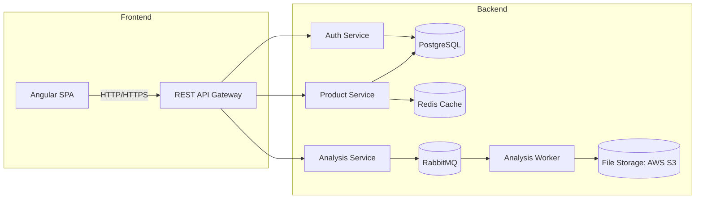

# System Design Specification

## 1. Architecture Overview

### 1.1 High-Level Architecture  
This system follows a client-server, modular monolith approach with clear separation between the Angular SPA (frontend) and the Node.js/Express REST API (backend). Components are organized by business domain (Products, Analysis, Authentication) but run in a single deployable unit.  

Key characteristics:  
- Single-page application (SPA) consuming a REST API  
- Stateless backend services  
- Relational database (PostgreSQL) for primary data storage  
- Asynchronous processing for file analysis (RabbitMQ)  
- Redis for caching and session management  

### 1.2 Architecture Diagram  


### 1.3 Technology Stack  
- Frontend technologies  
  - Angular 15+, TypeScript  
  - RxJS, Angular Material / Bootstrap  
  - HTML5, SCSS  

- Backend technologies  
  - Node.js 18+, Express, TypeScript  
  - TypeORM (or Prisma) for database access  
  - RabbitMQ for job queue  
  - Multer for multipart handling  

- Database systems  
  - PostgreSQL 14+  
  - Redis for caching & session management  

- Third-party services and APIs  
  - AWS S3 (file storage)  
  - SendGrid (email notifications)  
  - Stripe (payment processing)  

- Development tools  
  - Docker & Docker-Compose  
  - Git & GitHub (or GitLab)  
  - ESLint, Prettier  
  - Jest (unit & integration tests)  
  - Cypress (E2E tests)  

---

## 2. Component Design

### 2.1 Frontend Components  
1. ProductListComponent  
   - Displays a paginated/filterable list of products  
   - Subscribes to ProductService.products$ stream  
2. ProductFormComponent  
   - Create/Edit form with validation (ReactiveForms)  
   - Invokes ProductService.addProduct / updateProduct  
3. FileAnalyzerComponent  
   - File input + drag-and-drop UI  
   - Calls ProductService.analyzeFile and displays results  
4. LoginComponent / RegisterComponent  
   - Handles user authentication flows  
   - Stores JWT in memory (or secure browser storage)  

Component interaction:  
- Components → Services → HTTP calls → Backend API → data → components

### 2.2 Backend Services  
1. **Auth Service**  
   - Routes: `/api/auth/login`, `/api/auth/register`, `/api/auth/refresh`  
   - JWT issuance, refresh tokens stored in Redis  
2. **Product Service**  
   - CRUD endpoints under `/api/products`  
   - Validates payload with JOI/Zod  
   - Uses TypeORM repositories for DB operations  
   - Publishes invalidation events to Redis cache  
3. **Analysis Service**  
   - Endpoint: `POST /api/analysis` (multipart/form-data)  
   - Accepts files via Multer, stores temporarily in S3  
   - Publishes job to RabbitMQ  
4. **Analysis Worker**  
   - Subscribes to RabbitMQ queue, processes files (OCR, metrics)  
   - Stores results back in PostgreSQL under `analysis_results`  

### 2.3 Database Layer  
- **Data access pattern:** Repository/Unit-of-Work via TypeORM  
- **Transactions:** Wrap multi-step operations in transactions  
- **Caching strategy:** Read-through/write-through on Redis for `products:list`  

---

## 3. Data Models

### 3.1 Database Schema

Products Table:  
```sql
CREATE TABLE products (
  id             UUID      PRIMARY KEY DEFAULT gen_random_uuid(),
  nombre         VARCHAR   NOT NULL,
  descripcion    TEXT,
  referencia     VARCHAR   UNIQUE NOT NULL,
  imagen_url     VARCHAR,
  created_at     TIMESTAMP NOT NULL DEFAULT NOW(),
  updated_at     TIMESTAMP NOT NULL DEFAULT NOW()
);
```

Users Table:  
```sql
CREATE TABLE users (
  id             UUID      PRIMARY KEY DEFAULT gen_random_uuid(),
  email          VARCHAR   UNIQUE NOT NULL,
  password_hash  VARCHAR   NOT NULL,
  role           VARCHAR   NOT NULL DEFAULT 'user',
  created_at     TIMESTAMP NOT NULL DEFAULT NOW(),
  updated_at     TIMESTAMP NOT NULL DEFAULT NOW()
);
```

AnalysisRequests Table:  
```sql
CREATE TABLE analysis_requests (
  id             UUID      PRIMARY KEY DEFAULT gen_random_uuid(),
  user_id        UUID      REFERENCES users(id),
  file_key       VARCHAR   NOT NULL,       -- S3 object key
  status         VARCHAR   NOT NULL,       -- pending|processing|completed|failed
  result         JSONB,                    -- analysis output
  created_at     TIMESTAMP NOT NULL DEFAULT NOW(),
  updated_at     TIMESTAMP NOT NULL DEFAULT NOW()
);
```

### 3.2 Data Flow  
1. Frontend calls `GET /api/products`  
2. Backend checks Redis → if cache miss, queries PostgreSQL → caches result → returns to client  
3. For `analyzeFile`, client posts file→ backend enqueues job → worker processes → updates `analysis_requests` → client subscribes/polls for status

---

## 4. API Design

### 4.1 Endpoints

| Method | Path                   | Description                         | Auth          | Body / Params                                          | Response                            |
|--------|------------------------|-------------------------------------|---------------|--------------------------------------------------------|-------------------------------------|
| POST   | /api/auth/register     | Register new user                   | public        | `{ email, password }`                                  | `{ user: {id, email}, token }`      |
| POST   | /api/auth/login        | User login                          | public        | `{ email, password }`                                  | `{ user: {id, email}, token }`      |
| GET    | /api/products          | List products                       | bearer token  | `?page`, `?limit`, `?filter`                           | `[{ id, nombre, referencia, ... }]` |
| POST   | /api/products          | Create product                      | bearer token  | `{ nombre, descripcion, referencia, imagen_url }`      | Product object                      |
| PUT    | /api/products/:id      | Update product                      | bearer token  | `{ nombre?, descripcion?, ... }`                       | Updated product                     |
| DELETE | /api/products/:id      | Delete product                      | bearer token  | —                                                      | `{ success: true }`                 |
| POST   | /api/analysis          | Analyze uploaded file               | bearer token  | Multipart form-data: `file: File`                      | `{ requestId: UUID, status: pending }` |
| GET    | /api/analysis/:id      | Get analysis result/status         | bearer token  | `:id`                                                  | `{ status, result? }`               |

### 4.2 API Patterns  
- **RESTful conventions:** resource-based URIs, standard HTTP verbs, proper status codes  
- **Pagination & filtering:** via query params  
- **File upload:** `multipart/form-data` handled by Multer  
- **Real-time updates (optional):** WebSocket channel for analysis status  

---

## 5. Security Design

### 5.1 Authentication Strategy  
- **JWT tokens** signed with RSA256  
- **Access tokens:** short-lived (15m), stored in memory or HttpOnly cookie  
- **Refresh tokens:** long-lived (7d), stored in HttpOnly cookie, rotated on use  

### 5.2 Authorization  
- **RBAC** with roles: `admin`, `user`  
- Middleware checks `req.user.role` against endpoint permissions  
- Resource-level guards ensure users can only modify their own data  

### 5.3 Data Protection  
- **Encryption in transit:** TLS/HTTPS for all endpoints  
- **Encryption at rest:** Database disk encryption & S3 SSE  
- **Input validation & sanitization:** JOI/Zod schemas on every request  

---

## 6. Integration Points

### 6.1 External Services  
- **AWS S3:** Stores uploaded files for analysis  
- **RabbitMQ:** Queuing of analysis jobs  
- **SendGrid:** Email notifications on certain events (e.g., product approval)  
- **Stripe:** (Future) payment processing for premium features  

### 6.2 Internal Integrations  
- **Redis Pub/Sub:** Invalidate caches across instances  
- **Worker Pool:** Scalable analysis workers subscribing to RabbitMQ  

---

## 7. Performance Considerations

### 7.1 Optimization Strategies  
- **Caching:**  
  - Redis for GET-heavy endpoints (`/api/products`)  
  - HTTP caching headers (ETags, Cache-Control)  
- **Database indexing:**  
  - Index on `products.referencia`, `analysis_requests.status`  
- **Query optimization:**  
  - Use pagination+cursor-based queries  
- **Frontend:**  
  - Lazy load feature modules  
  - Code splitting & AOT compilation  

### 7.2 Scalability  
- **Horizontal scaling:**  
  - Multiple Node.js instances behind a load balancer  
  - RabbitMQ worker pool scales independently  
- **Vertical scaling:**  
  - Increase DB resources or move to managed RDS cluster  
- **Sharding (future):**  
  - Partition `products` by region or tenant  

---

## 8. Error Handling and Logging

### 8.1 Error Handling Strategy  
- Centralized `errorHandler` middleware in Express  
- Custom error classes with HTTP status & codes  
- Client-facing errors standardized:  
  ```json
  { "error": { "code": "PRODUCT_NOT_FOUND", "message": "Product not found" } }
  ```

### 8.2 Logging and Monitoring  
- **Logging:** Winston logs to console & daily rotating files  
- **Aggregation:** ELK stack (Elasticsearch, Logstash, Kibana) or AWS CloudWatch  
- **Monitoring:**  
  - Prometheus + Grafana for metrics (CPU, memory, request latency)  
  - Sentry for error reporting  

---

## 9. Development Workflow

### 9.1 Project Structure  
```
/frontend
  /src
    /app
      /components
      /services
      /models
      app.module.ts
/backend
  /src
    /controllers
    /services
    /repositories
    /workers
    /middlewares
    app.ts
/docker-compose.yml
```

### 9.2 Development Environment  
- **Local setup:**  
  - Docker-Compose spins up Postgres, Redis, RabbitMQ  
  - `.env.development` for local variables  
- **Env variables:**  
  - `DATABASE_URL`, `REDIS_URL`, `JWT_PRIVATE_KEY`, `AWS_S3_BUCKET`, etc.  
  - Separate `.env.staging` & `.env.production`  

### 9.3 Testing Strategy  
- **Unit tests:** Jest for services & utils (target ≥ 80% coverage)  
- **Integration tests:** Supertest against a test containerized DB  
- **E2E tests:** Cypress for critical user flows (login, CRUD, file upload)  
- **CI checks:** Linting, type checks, test suite on every PR  

---

## 10. Deployment Architecture

### 10.1 Deployment Strategy  
- **CI/CD pipeline:** GitHub Actions  
  - Stages: lint → build → test → publish Docker images → deploy  
- **Environments:** Development, Staging, Production  

### 10.2 Infrastructure  
- **Hosting platform:** AWS ECS (Fargate) or Kubernetes (EKS)  
- **Container strategy:** Docker images for frontend & backend  
- **Database hosting:** AWS RDS (PostgreSQL Multi-AZ)  
- **Cache & queue:** AWS ElastiCache (Redis), RabbitMQ cluster (self-managed or RabbitMQ Cloud)  

---

**Trade-offs & Considerations**  
- Monolith simplifies deployment, but services can be extracted as traffic grows.  
- RabbitMQ adds operational overhead; can be replaced by AWS SQS for lower maintenance.  
- PostgreSQL chosen for relational product data; NoSQL could be adopted for high flexibility in schema.  

This specification provides a detailed blueprint to start implementation and scale iteratively.